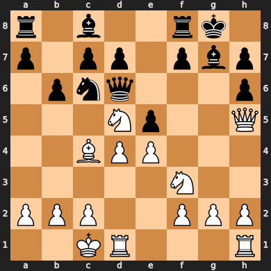

# Chess-Bot
Chess Bot I wrote to learn about minimax, tree pruning and just to have fun

please bear with the sarcastic editing of the demo video below, not sure what i was thinking

[demo of the bot beating me]()

Chess 1 was my first attemt to create the chess board from scratch using a pandas dataframe and python classes/objects to store information about pieces
After reaching 700 lines of code and not much to show for it, I chose to restart using the python-chess library. This allowed me to focus on creating a capable chess bot instead of 
implemtnnting the rules of chess through painful trial, error and debugging.
Also had some fun with the "soundtrack" I made.

Overall, I learned a ton about pygame, minimax algorythims and recursion.
Oh I also added Lichess api functionality so that you can verse the bot online.
It ended up being >1100ELO but <1400ELO so not amazing, but actually a bit better than me
